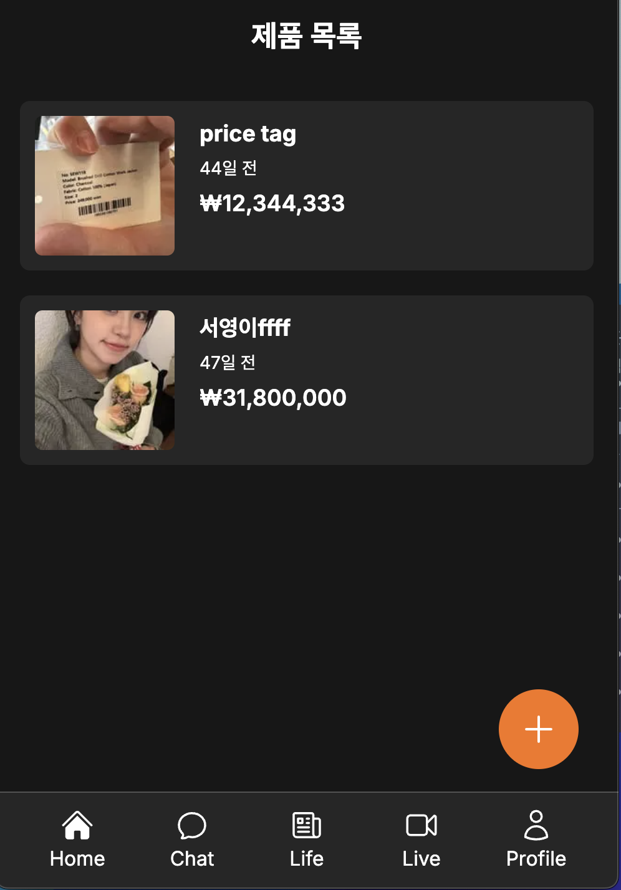
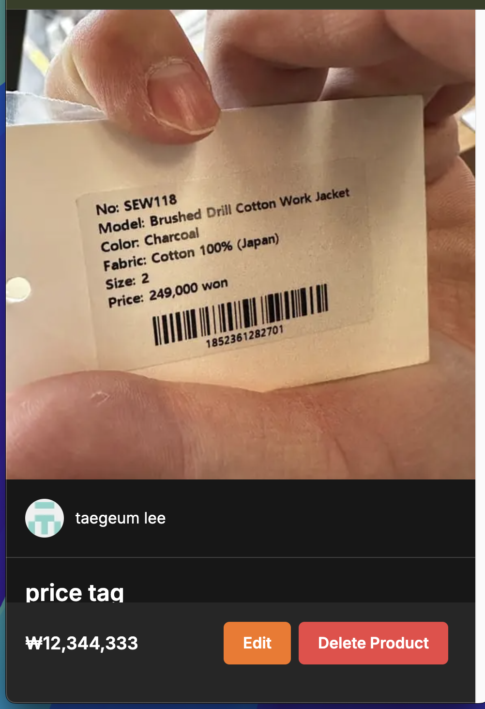
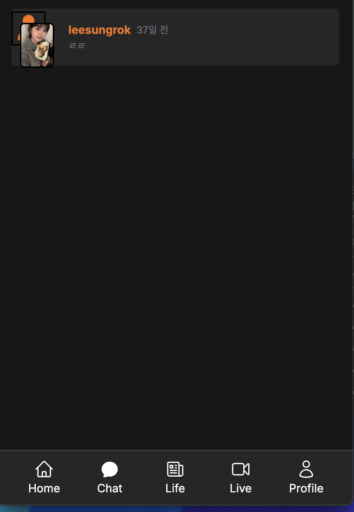
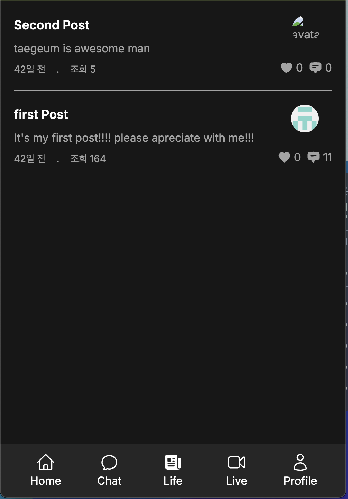

# 당근 마켓 클론





Next.js 14와 TypeScript를 사용하여 구현한 당근 마켓 클론 프로젝트입니다.

## 주요 기능

### 1. 사용자 인증

- GitHub OAuth 소셜 로그인
- SMS 인증 (한국 전화번호)
- Iron Session 기반 세션 관리

### 2. 제품 관리

- 무한 스크롤 제품 목록
- 제품 상세 정보
- 제품 등록/수정/삭제
- Cloudflare Images 기반 이미지 업로드

### 3. 커뮤니티 (Life)

- 게시글 작성/조회
- 좋아요 기능
- 조회수 추적
- 댓글 시스템

### 4. 실시간 채팅

- Supabase Realtime을 활용한 실시간 채팅
- 채팅방 목록 및 1:1 채팅
- 메시지 전송 및 수신
- 이미지 첨부 기능

## 기술 스택

### Frontend

- Next.js 14 (App Router)
- React 18
- TypeScript
- Tailwind CSS
- React Hook Form
- Zod (데이터 검증)

### Backend

- Next.js API Routes
- Prisma ORM
- SQLite
- Iron Session
- Supabase Realtime

### 인프라

- Cloudflare Images (이미지 저장소)
- GitHub OAuth
- SMS 인증 서비스

## 설치 방법

1. 저장소 클론

```bash
git clone https://github.com/yourusername/carrot-market-clone.git
cd carrot-market-clone
```

2. 의존성 설치

```bash
npm install
```

3. 환경 변수 설정

```env
GITHUB_CLIENT_ID=
GITHUB_CLIENT_SECRET=
CLOUDFLARE_ID=
CLOUDFLARE_TOKEN=
COOKIE_PASSWORD=
DATABASE_URL=
SUPABASE_URL=
SUPABASE_KEY=
```

4. 데이터베이스 마이그레이션

```bash
npx prisma migrate dev
```

5. 개발 서버 실행

```bash
npm run dev
```

## 프로젝트 구조
